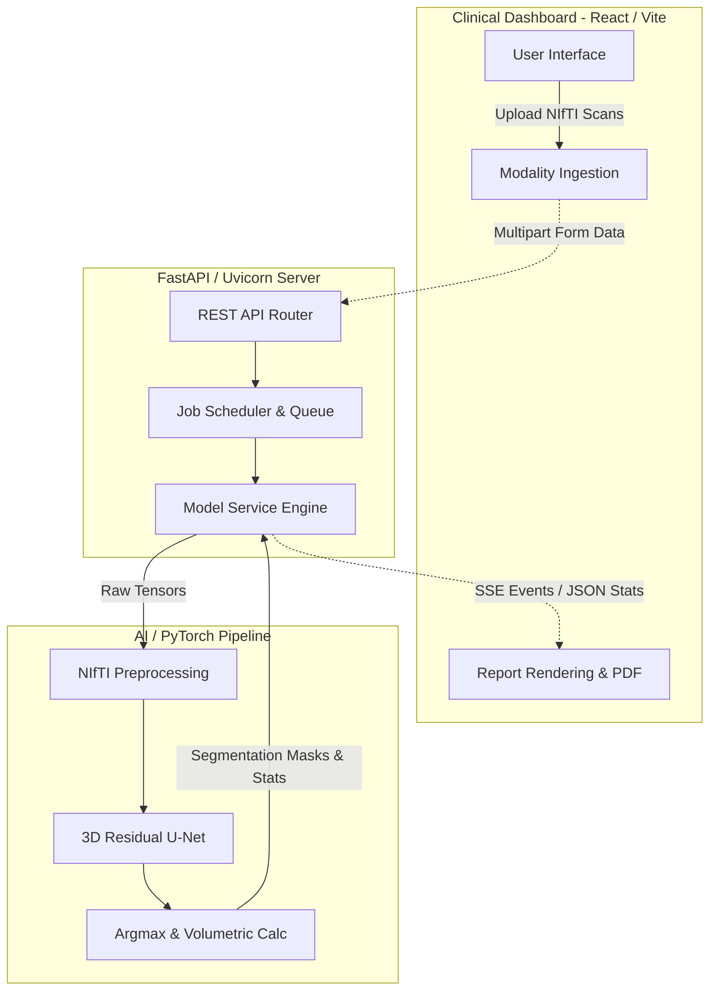

<div align="center">
  

# 🧬 NeuroSeg AI: 3D Brain Tumor Segmentation
**Advanced Radiology Intelligence & Volumetric Analysis**

[](https://www.python.org/)
[](https://pytorch.org/)
[](https://monai.io/)
[](https://fastapi.tiangolo.com/)
[](https://reactjs.org/)
[](https://tailwindcss.com/)

</div>

---

## 🌟 Executive Summary

**NeuroSeg AI** is a state-of-the-art medical imaging application designed for fully autonomous, high-precision 3D brain tumor segmentation. Leveraging a deep **Residual U-Net (UNet-3D)** architecture, the platform ingests patient NIfTI scans (FLAIR, T1, T1CE, T2) and performs computationally intensive volumetric spatial analysis to classify Whole Tumor (WT), Necrotic Core (NCR), Peritumoral Edema (ED), and GD-Enhancing Tumor (ET) boundaries.

Designed for clinical agility, it bridges sophisticated PyTorch deep learning with a blazing-fast **FastAPI** backend and an ultra-modern, glassmorphism **React** diagnostic dashboard.

---

## 🏗️ System Architecture & Data Flow

Our architecture is decoupled to ensure inference speed, parallel processing, and fluid user experience.



---

## 🚀 Key Capabilities

- **Autonomous 3D Segmentation**: Precise tumor localization and quad-class categorization using customized MONAI/PyTorch UNet-3D.
- **Multi-Modal Support**: Intelligent aggregation of native weighted (T1), contrast-enhanced (T1CE), T2-weighted, and Fluid-Attenuated (FLAIR) dimensions.
- **Volumetric Spatial Analysis**: Real-time extraction of tumor mass bounding boxes (HWD), volumetric density in mm³ and primary focal point tracking.
- **Automated Clinical Reporting**: Generate pixel-perfect, highly professional one-page Clinical Analysis Reports into PDF format directly from the browser window.
- **High-Concurrency Pipeline**: Handles heavyweight `.nii.gz` scans locally or via HuggingFace Spaces through optimized ONNX exports.

---

## 🛠️ Technology Stack

### Artificial Intelligence & ML Pipeline
*   **Deep Learning**: [PyTorch](https://pytorch.org/) core computation engine.
*   **Medical Vision**: [MONAI](https://monai.io/) (Medical Open Network for AI) transforms and loss primitives.
*   **Neuroimaging**: [NiBabel](https://nipy.org/nibabel/) for robust read/write of `.nii` / `.nii.gz` formatted medical binaries.
*   **Architecture**: Optimized 3D Residual U-Net.

### High-Performance Backend
*   **Framework**: [FastAPI](https://fastapi.tiangolo.com/) + Pydantic.
*   **Server**: Uvicorn ASGI server with SSE (Server-Sent Events) streaming.
*   **Concurrency**: Singleton ModelService pattern handling thread-safe background inference.

### Clinical Dashboard (Frontend)
    
*   **Core**: [React 18](https://react.dev/) + TypeScript + Vite.
*   **Styling**: [Tailwind CSS](https://tailwindcss.com/) with pure Vanilla CSS extensions.
*   **Motion**: [Framer Motion](https://www.framer.com/motion/) scale & stagger micro-animations.
*   **Icons**: Lucide React workflow visualizations.

---

## 📂 Project Anatomy

```text
Brain-Tumor-3D/
├── frontend/                     # React + Vite + TypeScript Frontend
│   ├── src/
│   │   ├── components/           # Reusable UI (Sidebar, MedicalReport, etc)
│   │   ├── hooks/                # Async job polling & SSE tracking
│   │   ├── index.css             # Vanilla CSS + Tailwind tokens
│   │   └── App.tsx               # Primary Orchestrator & Viewport
├── app/                          # FastAPI Backend Server
│   ├── routes/                   # API entry points (ingestion, predict)
│   ├── main.py                   # Server lifespan and static file serving
│   └── model_service.py          # Singleton pipeline orchestrating UNet-3D
├── scripts/                      # Machine Learning Training Environment
│   ├── train.py                  # Distributed model training loop
│   ├── unet3d.py                 # Core AI topology definitions
│   ├── dataset.py                # DataLoader & Transform pipelines
│   └── cross_validate.py         # Statistical K-Fold validation methods
├── models/                       # Inference Weights Directory
│   └── best_model.pth            # 275MB Checkpoint (Git LFS)
└── sample_data/                  # Demo BraTS NIfTI files
```

---

## ⚡ Deployment & Installation Guide

For researchers and developers, establishing the local environment is straightforward.

### 1. Repository Setup & LFS

Since medical models are massive, verify that Git LFS is operational.
```bash
git clone https://github.com/rushikesh249/NeuroSeg-AI.git
cd NeuroSeg-AI

# Note: The 275MB .pth model file is hosted externally to respect GitHub bandwidth limits.
# Please download `best_model.pth` from the provided releases/drive link and place it in the `models/` directory.
```

### 2. Backend Initialization

```bash
# Instantiate Virtual Environment (Python 3.10+)
python -m venv venv
source venv/bin/activate  # Windows: venv\Scripts\activate

# Install Medical AI Stack
pip install -r requirements.txt

# Launch FastAPI Server
python -m uvicorn app.main:app --host 0.0.0.0 --port 8000
```

### 3. Frontend Compilation

In a separate terminal, deploy the diagnostic dashboard:
```bash
cd frontend
npm install

# Option A: Local Dev Server
npm run dev

# Option B: Build for Production (Recommended)
# The backend will automatically serve these static files on localhost:8000
npm run build
```

---

## 🩺 System Usage & Clinical Workflows

1. Access the Intelligence Dashboard via **http://localhost:8000**.
2. Navigate to **Modality Ingestion** and supply the 4 required MRI modalities (`FLAIR, T1, T1CE, T2`).
3. Set the **Optimization Mode** (Fast/Precision) and engage the inference pipeline.
4. Review the 3D rendered spatial segments and algorithmic diagnostic summaries.
5. Click **"Print / Save PDF"** to generate the final verified Clinical Analysis Report.

---

## 📜 Legal & Licensing

This software is released under the **MIT License**. It is strictly intended for research, pedagogical, and demonstrative purposes. *NeuroSeg AI is not certified for definitive clinical diagnosis without human radiology oversight.* 

<p align="center">
  <i>© 2026 Neuroseg AI Labs • Advanced 3D Radiology Intelligence</i>
</p>
